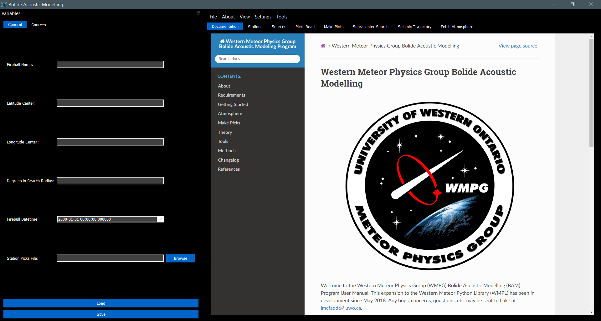

.. Supracenter documentation master file, created by
   sphinx-quickstart on Mon Jun  3 11:53:56 2019.
   You can adapt this file completely to your liking, but it should at least
   contain the root `toctree` directive.

.. # with overline, for parts
.. * with overline, for chapters
.. =, for sections
.. -, for subsections
.. ^, for subsubsections
.. ", for paragraphs

###############
Getting Started
###############

Configuring BAM (Optional)
==========================

Before running events on BAM, it may be useful to configure the program-wide settings. These can be changed in Settings>Preferences at any time, and are stored in a file supra/Misc/BAMprefs.bam. The default settings are good enough to run out of the box, but you may want to tweak some of the settings based on what atmospheric data you have available. Once this is done, saving will update the BAMprefs file. 

I recommend defining the workspace to a place that is easy to find. The .bam files are best put in that working directory, and any information are best put in <working directory>/<fireball name>/ since the program will make these folders for you anyways.

Setting Up an Event
===================

An individual event is defined by its .bam file, the idea being that .bam files can be saved on one computer and opened on another for group analysis of an event. It is recommended that every simulation that you run should be on a separate .bam file. This file may contain the metadata, stations, and atmospheric data for that event, if they are used. All the data can be loaded into the .bam file so that the raw data may be deleted if needed (although it is recommended that backups are kept).

The parameters of the event should be entered in the "variables" toolbar on the left side. This toolbar is dragable, dockable, and can be shown/hidden by pressing "v". It is not necessary to completely fill in every entry, the program actually has enough defaults in place to run without needing much filled in. 

If you are just starting with an event, the key is to fill in as much of the "General" section as known. The program will fill in the rest of the defaults in this section. If either of the fragmentation or ballistic searches are being done, then it is important to fill in the "Sources" tab with your search area. 

Once this is done, you can save your .bam file anywhere on your computer. I recommend putting all of your .bam files in the same place, such as your working directory.

Downloading Stations
====================

Once the "variables" tab is filled in as best as possible (most importantly the approximate time and location) and saved, then it is time to download nearby stations. The Degrees in Search Radius variable defines the radius of stations to be downloaded around the latitude and longitude center. 

Picking Data Centers
--------------------

The data centers to download from can be selected in Settings>Station Download Sources. The user may toggle which data centers to take data from, which will be saved in supra/Misc/BAMStationprefs.bam. I recommend using all reliable data centers unless some error is causing a specific one not to work. This program uses the International Federation of Digital Seismic Networks Web Services (FDSNWS) to download the seismic data.

Citing Station Data
-------------------

Stations should be cited by network. For example, using station GR-I26H1 would require a citation for the GR network. Prefered network citations and DOIs can be found here: https://www.fdsn.org/networks/.

Adding Stations Manually
------------------------

Stations may be added manually by clicking Add Stations and indicating where the compatible .SAC or .mseed file is located.

Managing Station Data
---------------------

The station data can be downloaded by selecting Download Stations. All stations within the selected area of the selected data centers will then be downloaded to your event's working directory as .mseed files, as long as the file is at least 1 kb in size. Stations will appear on the screen once they have downloaded, and may be removed by clicking the button on the left of the station. Save Stations saves all of the enabled stations to the current event .bam file. Load Stations adds all of the stations from the current event .bam file to the window.

Once the stations are downloaded, then the minimum information required to analyze an event is now ready.