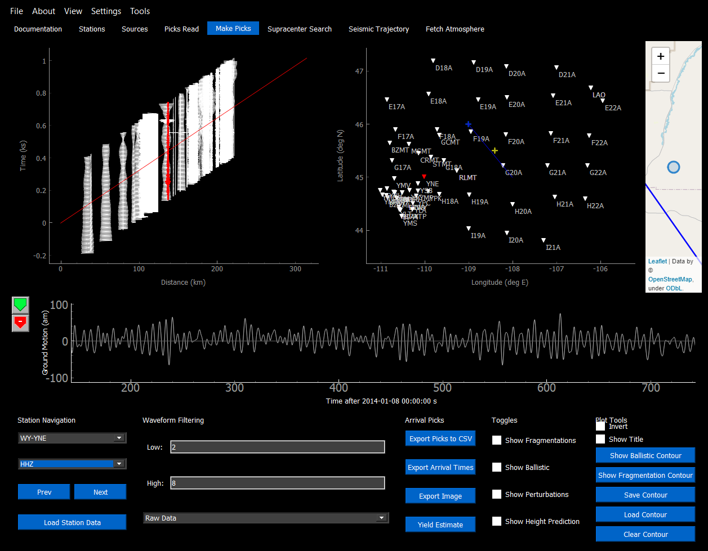
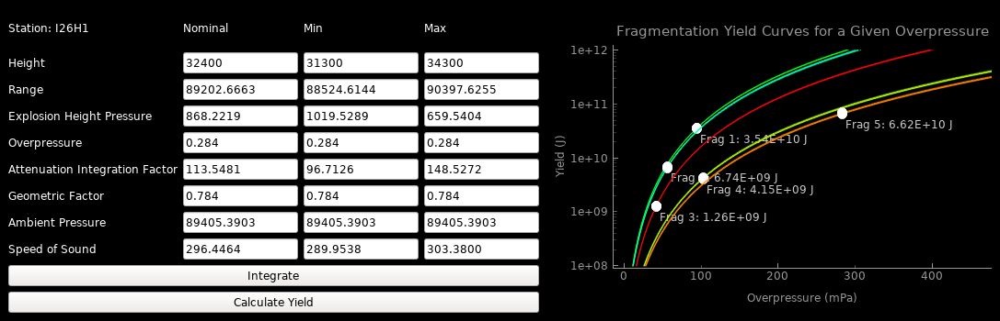

.. Supracenter documentation master file, created by
   sphinx-quickstart on Mon Jun  3 11:53:56 2019.
   You can adapt this file completely to your liking, but it should at least
   contain the root `toctree` directive.

##########
Make Picks
##########

The make picks window allows the user to analyze the waveforms at each station. The intended purpose of this screen is to have the user identify where each pick is on the waveform and export the station picks file (.csv) for use in other parts of the program. This allows the user to search for fragmentation and ballistic solutions with the picks that they have created.

Usage
=====

Once a .bam event file is created, including station and optional atmospheric files, navigate to the Make Picks tab and click "Load Station Data". The program will begin calculating the arrival times to every station. For each station it will calculate (if the respective data is available and the switch is toggled on):

* The arrival time of each fragmentation point given
* The arrival time of the most likely ballistic wave
* The perturbed arrivals of the above

The arrival times for an event will be saved, so that running the same event again will not recalculate the times. The times will only be recalculated for the following reasons:

* The number of fragmentations change
* Ballistic/fragmentation arrivals are toggled on/off
* The number of perturbations change
* The number of stations change
* The recalculate times parameter is toggled on in the Preferences menu

Once the program is done calculating times, the GUI will change, and the waveforms can be freely navigated.

Shortcuts
=========

* Make Pick: Ctrl + Left Click
* Delete Pick: Shift + Left Click
* Next Waveform: D
* Previous Waveform: A
* Bandpass Current Waveform: W
* Spectrogram of Current Waveform: S 
* Convolution Filter of Current Waveform: C
* Change Pick Group: UP/DOWN

Station Navigation
==================

The stations can be navigated most easily by "A" and "D" to go to the previous and next waveforms respectively. The waveforms are ordered in distance away from the lat/lon_centre defined in the INI Builder. Using the drop down menus, any station can be jumped to, and the channel of the waveform may be selected. For measuring meteors seismically and infrasonically, typically the BHZ, HHZ, and BDF bands are used.

Exporting Picks
===============

Once all of the user picks have been made on the waveforms, the "Export CSV" button in the lower right corner may be clicked to output a .csv file. It is recommended that you place this .csv file in your working directory to easily access it through other parts of the program. To further edit the station picks, the station picks file may be loaded into the Picks Viewer window to be fine-tuned.

These picks may be loaded into the Supracenter or Acoustic Trajectory modules of the program.

Yield Estimater
===============

A window which will estimate the yield of a fragmentation from the data provided from a given station. In order to use, select the required station from the Make Picks tab, and make sure that the correct waveform is shown, that will be analyzed. Click "Yield Estimater" to bring up the yield estimation window. 

Fill in the nominal height of the burst that is to be estimated. If this is not known, use the "Show Height Prediction" or "Solve Heights" options on the waveform. The minimum and maximum heights can be estimated by the user looking at the graph produced by "Show Height Prediction", and estimating what the upper and lower bounds on the possible explosions are.

After filling in the heights, the user can click "Integrate", and the program will fill in as much information as it can for the other factors. The user must fill in the rest of each column being used for Calculate Yield to work. This part of the program may be used with either only the "Nominal" column, or all three columns.

Calculate yield will show the "blast curve" of the parameters entered. The point plotted on the curve represents the yield for the overpressure entered in.  

.. note::
	It is recommended to use large n_theta and n_phi values (>1000) since very precise release angles are required to find the geometric factor.

.. toctree::
   :maxdepth: 2

   

